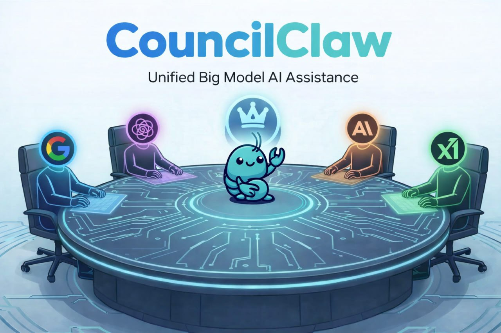

# CouncilClaw



**CouncilClaw: Multi-model deliberation, single-agent execution.**

CouncilClaw combines NanoClaw-style agent execution with LLM-council-style anonymous deliberation:
- **Simple tasks**: route to direct execution path.
- **Complex tasks**: run through first opinions → blind rotated review → chairman synthesis.
- **Execution**: run approved plan chunks and return output + council trace.

## Current Status (v0.1)
Implemented:
- TypeScript project bootstrap
- Core data contracts/interfaces
- Complexity router heuristic + task-type classifier
- Multi-chunk decomposition with dependencies
- Council anonymizer
- Blind-review scoring + dissent detection
- Chairman weighted synthesis logic
- User-selectable chairman model (with allowlist control)
- OpenRouter-ready LLM provider (auto-fallback to stub if key missing)
- Parallel first-opinion calls + retry/backoff for model requests
- LLM-based chairman rationale refinement
- Webhook API (`POST /task`) + health endpoint (`GET /health`)
- Persistent JSONL council trace store
- Execution stub

## Project Layout
```text
src/
  api/
    webhook.ts
  config/
    env.ts
  council/
    anonymizer.ts
    chairman.ts
    council-engine.ts
    reviewer.ts
  execution/
    executor.ts
  llm/
    model-registry.ts
    model-selection.ts
    openrouter-client.ts
    provider.ts
  planning/
    decomposer.ts
  router/
    complexity-router.ts
    task-type-router.ts
  telemetry/
    trace.ts
    store.ts
  types/
    contracts.ts
  index.ts
assets/
  branding/
    councilclaw-banner.jpg
data/
  council-traces.jsonl
```

## Quick Start
```bash
npm install
npm run dev
npm run dev:server
npm run typecheck
npm run build
```

## API (server mode)
Start server:
```bash
npm run dev:server
```

Health:
```bash
curl http://localhost:8787/health
```

Run task:
```bash
curl -X POST http://localhost:8787/task \
  -H 'Content-Type: application/json' \
  -d '{
    "userId":"u1",
    "channel":"telegram",
    "text":"/chairman google/gemini-2.5-pro build auth API and tests",
    "chairmanModel":"google/gemini-2.5-pro"
  }'
```

## Environment
```bash
OPENROUTER_API_KEY=
OPENROUTER_BASE_URL=https://openrouter.ai/api/v1
OPENROUTER_MAX_RETRIES=2
OPENROUTER_RETRY_BASE_MS=500
COUNCIL_MODELS=openai/gpt-4.1-mini,google/gemini-2.5-flash,anthropic/claude-3.5-sonnet
CHAIRMAN_MODEL=openai/gpt-4.1
ALLOWED_CHAIRMAN_MODELS=openai/gpt-4.1,google/gemini-2.5-pro
PORT=8787
COUNCIL_TRACE_PATH=data/council-traces.jsonl
```

## Chairman Model Authority
Users can request a chairman model in two ways:
1. Structured: `task.options.chairmanModel`
2. Inline text: `/chairman <model>` or `chairman: <model>`

Selection behavior:
1. If requested model is allowlisted, it is used.
2. If not allowlisted, system falls back to default `CHAIRMAN_MODEL`.
3. Fallback reason is included in council trace.
